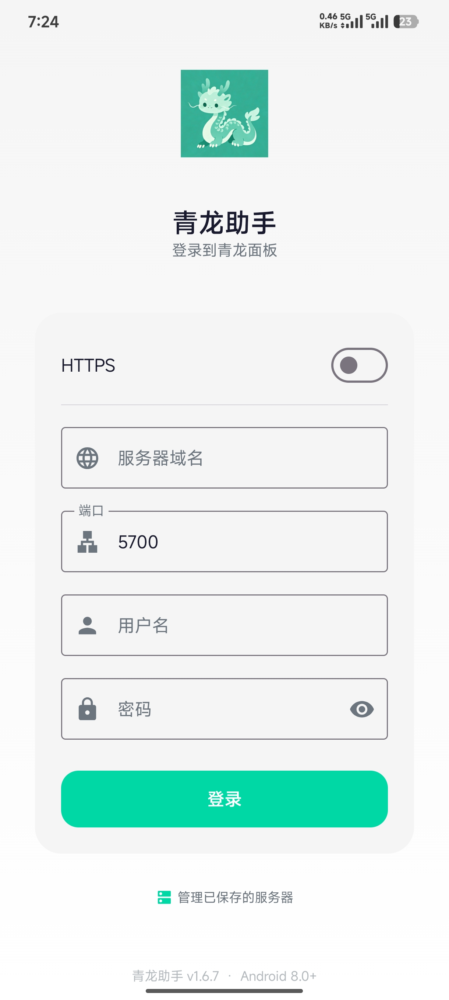
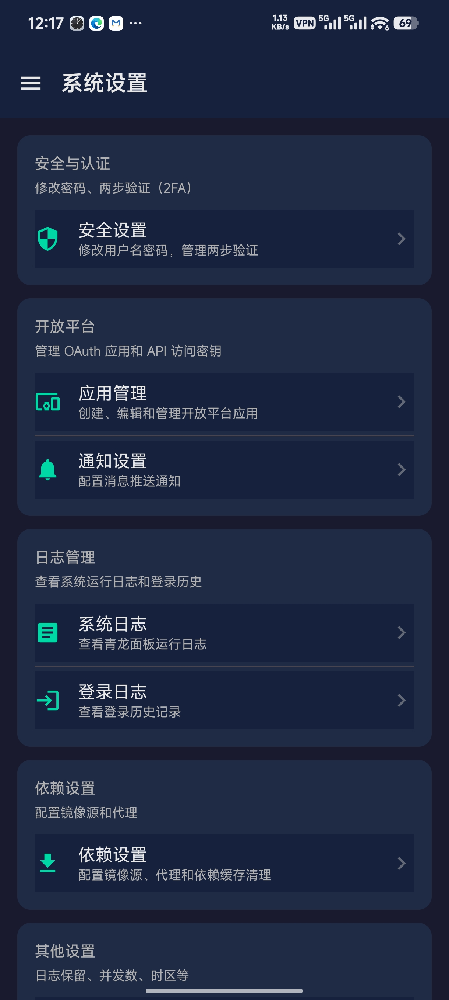
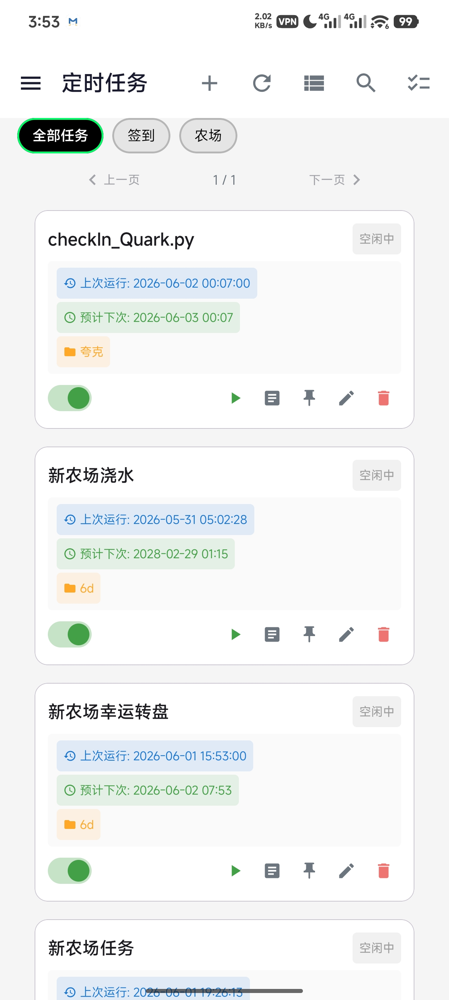
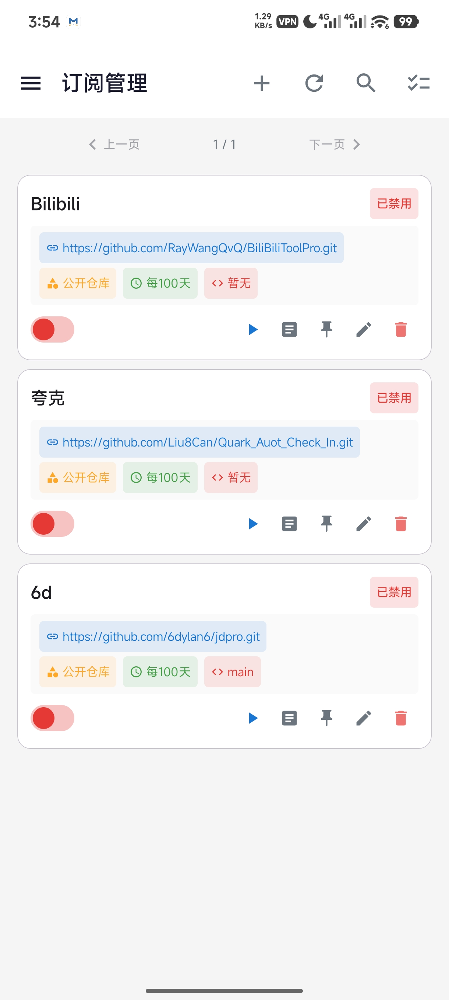
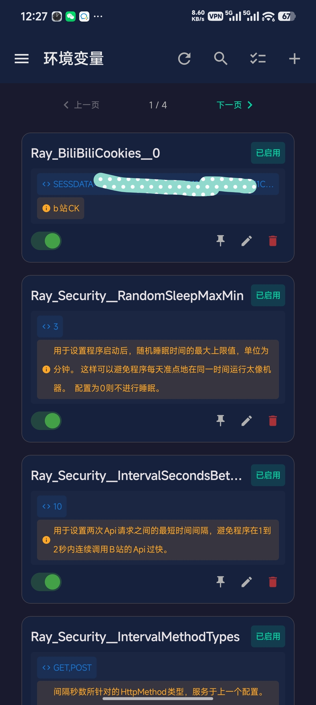
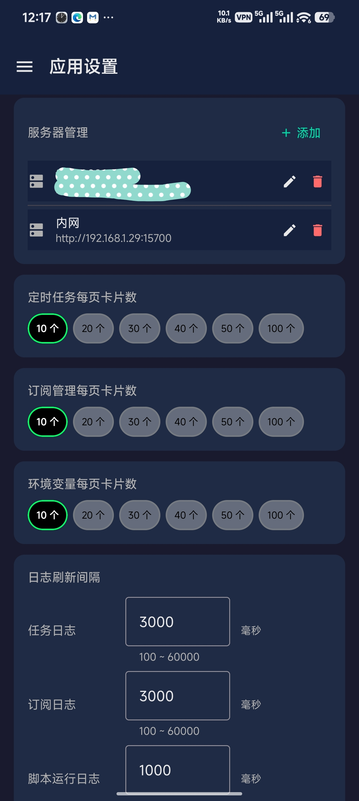

# 青龙助手

青龙面板 Android 客户端，基于 Jetpack Compose + Kotlin + Clean Architecture 构建，覆盖青龙面板全部核心管理功能。通过左侧抽屉导航栏快速切换各模块，提供接近原生 Web 端的完整管理体验。


## 🔐 登录与服务器管理

| 登录页 | 导航抽屉 |
|:---:|:-----:|
|  |  |

### 登录功能

- **HTTP / HTTPS 协议切换**：支持直连青龙面板（HTTP）或通过 Nginx/Caddy 反向代理（HTTPS）连接
- **域名 + 端口分开输入**：灵活适配不同部署方式，无需拼接 URL
- **用户名 + 密码认证**：Token 自动加密保存至 `EncryptedSharedPreferences`
- **两步验证（2FA）**：面板开启 2FA 时自动检测并弹出验证码输入框，输入正确后自动完成登录
- **自动登录**：下次启动时自动尝试用已保存 Token 登录，Token 过期则用账号密码重新获取
  - 先试 Token → 成功则直接进入主页
  - Token 无效 → 用保存的账号密码自动登录 → 获取新 Token
  - 2FA 面板 → 提示用户手动输入验证码
- **超时处理**：网络请求 30 秒超时，超过则提示用户手动登录
- **密码明文/密文切换**：输入框右侧小眼睛按钮可切换密码可见性

### 服务器管理

| 功能 | 说明 |
|------|------|
| **多服务器** | 保存多个青龙面板配置，快速切换 |
| **新增服务器** | 填写地址、端口、账号密码，保存后可一键登录 |
| **编辑服务器** | 修改已有服务器的地址、端口、凭证 |
| **删除服务器** | 移除不再使用的服务器配置 |
| **快速切换** | 导航抽屉底部点击「切换服务器」，选择后自动登录 |
| **命名** | 每个服务器可自定义显示名称 |

---

## 📋 定时任务

| 定时任务 |
|:---:|
|  |

### 任务列表
- 分页卡片展示所有定时任务，支持自定义每页显示数量（10~100）
- 每张卡片显示：任务名称、运行状态、最后执行时间、下次运行时间、任务标签
- 运行状态用颜色区分：绿色=运行中、灰色=已禁用、蓝色=等待中
- 自定义每页卡片数量（应用设置中调整）

### 视图标签
- **内置视图**：「全部」「运行中」「已禁用」等快捷过滤
- **自定义视图**：创建/编辑/删除自定义标签，按多条件组合过滤（属性 + 操作符 + 值）
- 支持 `and`/`or` 多条件关系

### 搜索
- 三种搜索模式：按名称 / 按订阅 / 按标签，搜索框左侧切换
- 模糊匹配，实时过滤

### 批量操作
长按任意任务卡片进入批量选择模式，支持：
- ✅ 批量运行
- ✅ 批量停止
- ✅ 批量启用
- ✅ 批量禁用
- ✅ 批量删除

### 单任务操作
- **运行**：立即执行一次
- **停止**：中止正在运行的任务
- **启用/禁用**：切换任务是否参与定时调度
- **编辑**：修改任务名称、命令、定时规则、标签等
- **删除**：确认后删除

### 任务创建
完整的任务创建表单：
- 任务名称
- 执行命令
- 定时规则（Cron 表达式）
- 任务标签（逗号分隔）
- 允许多实例（开关）
- 日志名称
- 执行前命令
- 执行后命令

### 日志查看
- 点击任务卡片 → 实时日志弹窗
- **运行中的任务**：自动轮询刷新日志，右上角可切换自动刷新开关或手动刷新
- **已结束的任务**：显示历史日志文件列表，点击查看详情
- 日志支持选择复制，自动滚动到底部
- 历史日志支持多选删除

---

## 📦 订阅管理

| 订阅管理 |
|:---:|
|  |

### 订阅列表
- 卡片列表展示所有订阅，显示名称、URL、分支、状态
- 顶部搜索框支持关键词过滤

### 订阅操作
- **新增**：填写名称、URL、分支、白名单/黑名单等
- **编辑**：修改已有订阅的全部配置项
- **删除**：支持单个删除和批量删除

### 批量操作
- 批量启用 / 禁用订阅
- 批量运行（立即拉取更新）
- 批量停止（中止运行中的订阅）

### 日志查看
- 点击订阅卡片 → 实时日志或历史日志
- 运行中的订阅显示实时日志（自动刷新）
- 已完成的订阅显示历史日志文件列表

---

## 🌿 环境变量

| 环境变量 |
|:---:|
|  |

### 变量列表
- 列表展示所有环境变量，显示名称、值（默认隐藏）、备注、状态
- 顶部搜索框支持关键词过滤
- 自定义每页显示数量（10~100）

### 变量管理
- **新增**：添加名称、值、备注、标签等
- **编辑**：修改变量内容（名称、值、备注）
- **置顶**：重要变量可置顶到列表最前面
- **删除**：单个或批量删除

### 批量操作
- 批量启用 / 禁用环境变量
- 批量删除

---

## 📄 脚本管理

### 文件浏览器
- 树形目录结构，浏览青龙面板上的脚本文件
- 支持展开/折叠目录
- 支持新建文件夹、新建文件
- 支持的文件类型：Python（`.py`）、JavaScript（`.js`）、TypeScript（`.ts`）、Shell（`.sh`）等

### 代码编辑器
- 内置代码编辑器，支持语法高亮
- 根据文件扩展名自动切换编辑器模式
- 支持编辑后保存到面板

### 脚本运行
- 选中脚本 → 点击运行按钮 → 实时日志弹窗
- 通过 WebSocket 接收脚本运行日志（实时流式推送）
- 日志内容自动解析，去除 JSON 封装，只显示纯文本
- 关闭弹窗时若脚本仍在运行，自动发送停止请求
- **停止运行**：点击运行日志弹窗右上角可手动停止脚本

---

## 🛠️ 面板设置

| 面板设置 |
|:---:|
|  |

- 通过 APP 远程修改青龙面板端配置
- 覆盖面板 Web UI 上的各类设置项
- 提供简洁的移动端操作界面

---


## 🎨 应用设置

| 应用设置 |
|:---:|
|  |

### 外观
- **主题**：深色模式 / 浅色模式 / 跟随系统
- **字体大小**：小（85%）/ 默认（100%）/ 大（115%）/ 超大（130%）

### 服务器管理
- 查看已保存的服务器列表
- 新增、编辑、删除服务器
- 当前使用的服务器有标识

### 分页设置
| 设置项 | 默认值 | 可选值 |
|-------|-------|-------|
| 定时任务每页卡片数 | 10 | 10/20/30/40/50/100 |
| 订阅管理每页卡片数 | 10 | 10/20/30/40/50/100 |
| 环境变量每页数量 | 10 | 10/20/30/40/50/100 |

### 日志刷新间隔
| 设置项 | 默认值 | 范围 |
|-------|-------|------|
| 任务日志刷新间隔 | 3000ms | 1000~60000ms |
| 订阅日志刷新间隔 | 3000ms | 1000~60000ms |
| 脚本运行日志刷新间隔 | 3000ms | 1000~60000ms |

### 数据管理
- **清除全部数据**：恢复 APP 到刚安装时的初始状态（保留 APK）
- 清除范围：所有服务器配置、Token、账号密码、主题设置、分页设置等

### 关于
- APP 版本号
- 连接的青龙面板版本号
- 当前服务器地址

---

## 🔧 依赖管理

### 依赖列表
- 展示所有已安装的依赖，支持按类型筛选（Node.js / Python3 / Linux）
- 搜索框支持按依赖名称过滤

### 依赖操作
| 操作 | 说明 |
|------|------|
| **安装依赖** | 输入名称，选择类型（Node.js / Python3 / Linux），单个或多个批量安装 |
| **卸载依赖** | 普通卸载 |
| **强制卸载** | 强制删除依赖（忽略依赖关系） |
| **重新安装** | 重新安装指定依赖 |
| **取消安装** | 取消正在进行的安装任务 |

### 日志查看
- 点击依赖卡片查看安装/卸载日志
- 实时轮询刷新（每 3 秒）
- 自动滚动到底部，支持选择复制

---

## 🧭 导航与界面

### 左侧抽屉导航
从屏幕左侧向右滑动（或点击顶栏菜单按钮）打开导航抽屉，包含所有功能模块：

| 模块 | 图标 | 说明 |
|------|:----:|------|
| 定时任务 | 📋 | 应用默认首页 |
| 订阅管理 | 📦 | 管理仓库订阅 |
| 环境变量 | 🌿 | 管理 Key-Value 变量 |
| 依赖管理 | 🔧 | Node.js/Python/Linux 依赖 |
| 脚本管理 | 📄 | 浏览/编辑/运行脚本 |
| 配置文件 | ⚙️ | 编辑面板配置文件 |
| 系统设置 | 🛠️ | 青龙面板端配置 |
| 应用设置 | 🎨 | APP 本地配置 |
| 捐赠支持 | ❤️ | 支持开发者 |

### 底部功能区
- **切换服务器**：快速切换到其他青龙面板并自动登录
- **退出登录**：清除 Token 并返回登录页

### 用户信息显示
- 当前登录用户名
- 服务器地址（协议 + 域名 + 端口）
- 青龙面板版本号

---

---

## 💝 自愿捐赠

青龙助手 **完全开源免费**，所有功能均可无限制免费使用。如果你觉得这个 APP 对你有帮助，欢迎自愿捐赠支持开发者！

| 微信收款码 | 支付宝收款码 |
|:---------:|:-----------:|
|  |  |

**捐赠说明：**
- ❤️ 捐赠纯属 **自愿行为**，**即使不捐赠，所有功能也可免费完整使用**
- 📖 本软件为开源项目，代码完全公开，欢迎自行编译
- 🚫 捐赠不会获得任何特权或额外功能
- 🙏 感谢每一位支持者！

---

## 📄 开源协议

本项目基于 [GPL-3.0](https://www.gnu.org/licenses/gpl-3.0.html) 开源协议发布。

```
Copyright (C) 2026 青龙助手

This program is free software: you can redistribute it and/or modify
it under the terms of the GNU General Public License as published by
the Free Software Foundation, either version 3 of the License, or
(at your option) any later version.
```
